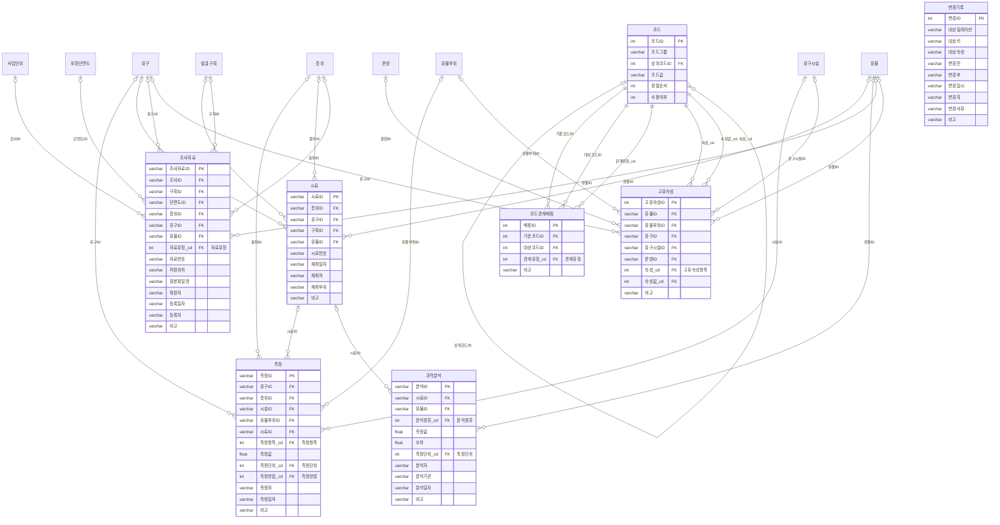
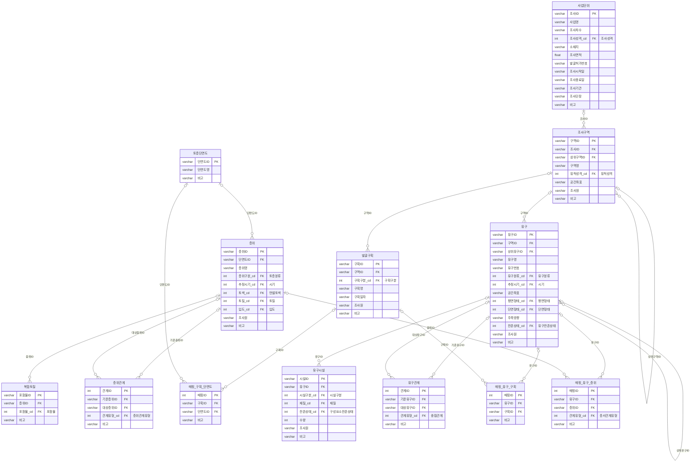
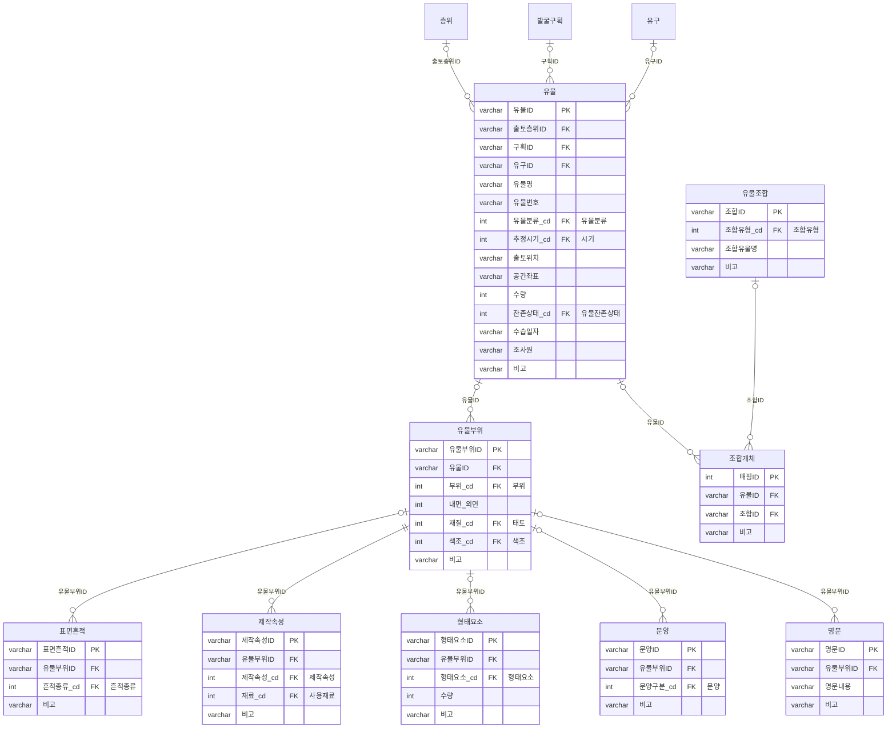

# ERD

`schema/schema.dbml` 에서 생성한 Mermaid 도표. 논문의 그림 1~3 에 대응한다. 전체 결선을 한 장으로 보려면 `schema.dbml` 을 [dbdiagram.io](https://dbdiagram.io) 에 붙여 넣는다.

선 끝의 기호 — `||` 정확히 하나 · `|o` 0 또는 하나 · `o{` 0 이상 여럿. 선 위의 이름은 참조하는 열(FK).

## 그림 1 · 공통 ERD

공통 기록 · 어휘 통제 · 기록의 변경. 다른 범주의 릴레이션은 참조 대상으로만(빈 상자) 나타난다. 코드사전으로 가는 선은 어휘 통제 릴레이션(코드관계매핑 · 고유속성)의 것만 그렸다.

## 그림 2 · 공간·층서·유구 ERD

코드사전(_cd 열)으로 가는 선은 생략했다. 도메인은 데이터 사전을 참조.

## 그림 3 · 유물 ERD

코드사전(_cd 열)으로 가는 선은 생략했다. 출토 맥락(층위 · 발굴구획 · 유구)은 참조 대상으로만 나타난다.

