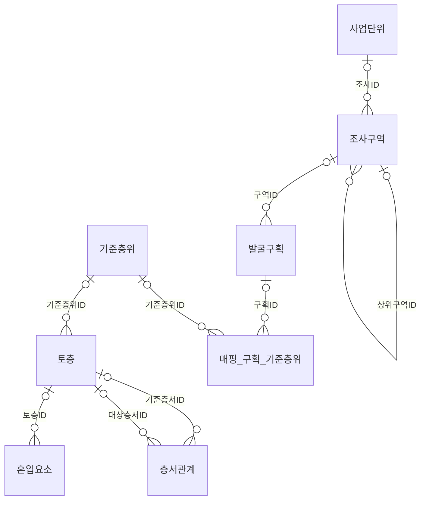
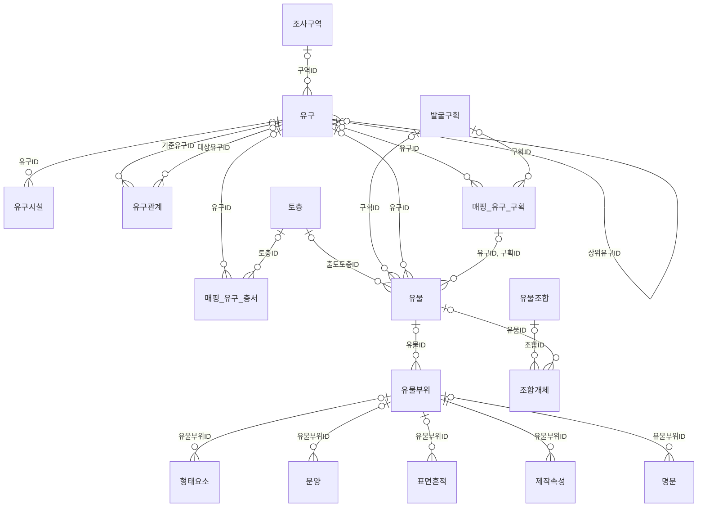
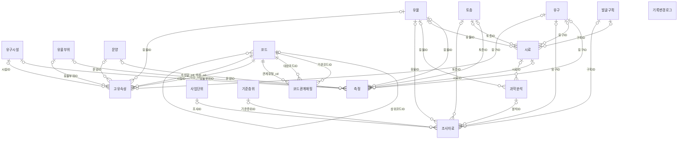

# ERD

관계선의 라벨은 외래키 속성이다. `_cd` 속성의 `코드` 참조선은 `코드관계매핑` · `고유속성` 외에는 생략한다.

## 공간·층서

```mermaid
erDiagram
  "사업단위" |o--o{ "조사구역" : "조사ID"
  "조사구역" |o--o{ "조사구역" : "상위구역ID"
  "조사구역" |o--o{ "발굴구획" : "구역ID"
  "기준층위" |o--o{ "토층" : "기준층위ID"
  "토층" |o--o{ "혼입요소" : "토층ID"
  "토층" |o--o{ "층서관계" : "기준층서ID"
  "토층" |o--o{ "층서관계" : "대상층서ID"
  "발굴구획" |o--o{ "매핑_구획_기준층위" : "구획ID"
  "기준층위" |o--o{ "매핑_구획_기준층위" : "기준층위ID"
```

## 유구·유물

```mermaid
erDiagram
  "조사구역" |o--o{ "유구" : "구역ID"
  "유구" |o--o{ "유구" : "상위유구ID"
  "유구" |o--o{ "유구시설" : "유구ID"
  "유구" |o--o{ "유구관계" : "기준유구ID"
  "유구" |o--o{ "유구관계" : "대상유구ID"
  "유구" |o--o{ "매핑_유구_구획" : "유구ID"
  "발굴구획" |o--o{ "매핑_유구_구획" : "구획ID"
  "유구" |o--o{ "매핑_유구_층서" : "유구ID"
  "토층" |o--o{ "매핑_유구_층서" : "토층ID"
  "토층" |o--o{ "유물" : "출토토층ID"
  "발굴구획" |o--o{ "유물" : "구획ID"
  "유구" |o--o{ "유물" : "유구ID"
  "매핑_유구_구획" |o--o{ "유물" : "유구ID, 구획ID"
  "유물" |o--o{ "유물부위" : "유물ID"
  "유물부위" |o--o{ "형태요소" : "유물부위ID"
  "유물부위" |o--o{ "문양" : "유물부위ID"
  "유물부위" |o--o{ "표면흔적" : "유물부위ID"
  "유물부위" ||--o{ "제작속성" : "유물부위ID"
  "유물부위" |o--o{ "명문" : "유물부위ID"
  "유물조합" |o--o{ "조합개체" : "조합ID"
  "유물" |o--o{ "조합개체" : "유물ID"
```

## 공통 기록 · 어휘 통제 · 기록 변경

```mermaid
erDiagram
  "유구" |o--o{ "측정" : "유구ID"
  "토층" |o--o{ "측정" : "토층ID"
  "유구시설" |o--o{ "측정" : "시설ID"
  "유물" |o--o{ "측정" : "유물ID"
  "유물부위" |o--o{ "측정" : "유물부위ID"
  "문양" |o--o{ "측정" : "문양ID"
  "시료" |o--o{ "측정" : "시료ID"
  "토층" |o--o{ "시료" : "토층ID"
  "유구" |o--o{ "시료" : "유구ID"
  "발굴구획" |o--o{ "시료" : "구획ID"
  "유물" |o--o{ "시료" : "유물ID"
  "시료" |o--o{ "과학분석" : "시료ID"
  "유물" |o--o{ "과학분석" : "유물ID"
  "사업단위" |o--o{ "조사자료" : "조사ID"
  "발굴구획" |o--o{ "조사자료" : "구획ID"
  "기준층위" |o--o{ "조사자료" : "기준층위ID"
  "토층" |o--o{ "조사자료" : "토층ID"
  "유구" |o--o{ "조사자료" : "유구ID"
  "유물" |o--o{ "조사자료" : "유물ID"
  "과학분석" |o--o{ "조사자료" : "분석ID"
  "코드" |o--o{ "코드" : "상위코드ID"
  "코드" ||--o{ "코드관계매핑" : "기준코드ID"
  "코드" ||--o{ "코드관계매핑" : "대상코드ID"
  "코드" ||--o{ "코드관계매핑" : "관계유형_cd"
  "유물" |o--o{ "고유속성" : "유물ID"
  "유물부위" |o--o{ "고유속성" : "유물부위ID"
  "유구" |o--o{ "고유속성" : "유구ID"
  "유구시설" |o--o{ "고유속성" : "시설ID"
  "문양" |o--o{ "고유속성" : "문양ID"
  "코드" ||--o{ "고유속성" : "속성_cd"
  "코드" ||--o{ "고유속성" : "속성값_cd, 속성_cd"
  "기록변경로그"
```
